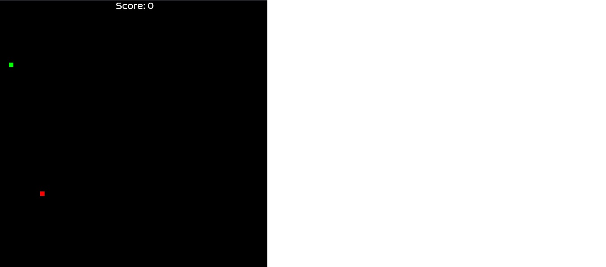
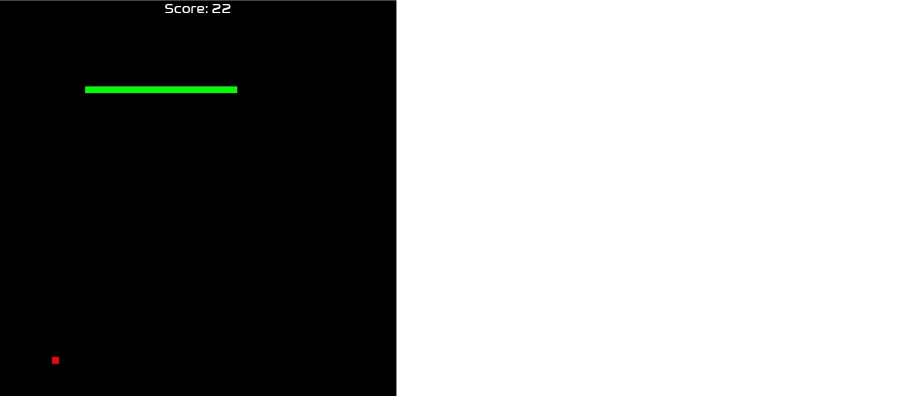
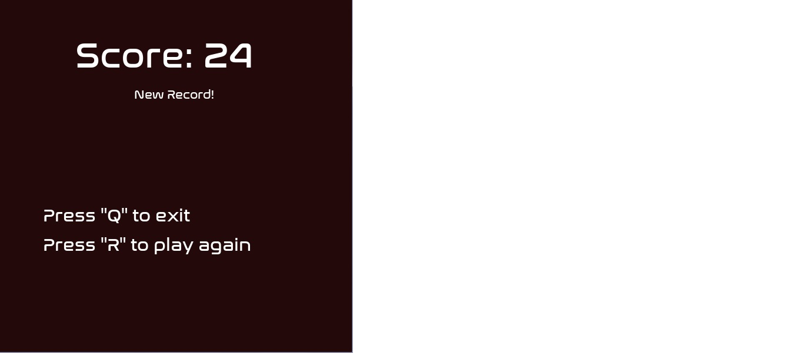
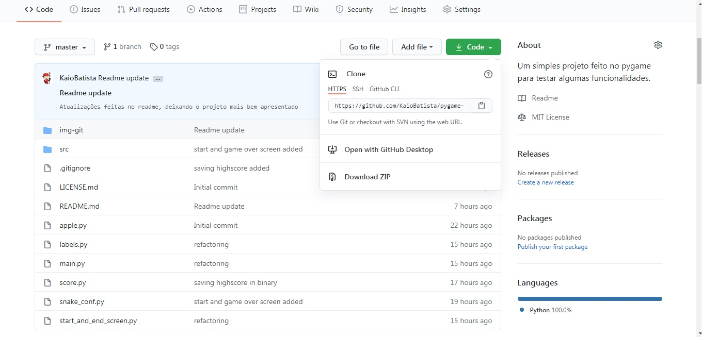

<h1>Pygame_Snake_Game</h1>

Versão atual: **V1.0**

Download: [mirror](https://www.github.com/KaioBatista/pygame-snake-game/archive/master.zip)

---

## Índices

- **Índices**

- [**Apresentação**](#Apresentação)

- [**Download e Instalação**](#Download_e_Instalação)
  
  - [Requisitos](#Requisitos)
  - [Download](#Download)
  - [Instalação](#Instalação)
  
- [**Problemas Conhecidos**](#Problemas_Conhecidos)

---

# Apresentação

O jogo contém uma tela de início simples, podendo ser iniciado ao pressionar _SPACE_ ou _RETURN_ ou até mesmo apertando no botão verde institulado "_Play!_".

A geração da maçã é randomizada pela função `randrange()` do módulo `random`, um módulo já presente no python, assim como o player, que se passa por uma cobra verde.

Cada vez que o player consome a maçã, é concedido 1 ponto para o _Score_, o qual demarca a pontuação do jogador

Caso o player encoste nele mesmo, a tela de game over é exibida juntamente com a pontuação final do player. É possivel apertar a tecla "_Q_" para sair, ou a tecla "_R_" para jogar mais uma vez.

Ao chegar na tela de game over do jogo, ocorre uma verificação na pasta do game procurando pelo arquivo `highscore.txt` o qual contém a pontuação máxima do usuário (em binário). Caso o jogador ultrapasse a pontuação máxima já existente, o arquivo será sobrescrito com um novo valor, quando isso ocorre é mostrado abaixo do _Score_ a mensagem "_New Record!_";

---

~~Sim, o developer, no caso eu, é um noob no próprio jogo, acontece...~~

Os comandos são super intuitíveis, utilize" _W_ " , "_A_",  "_S_" , "_D_" para se movimentar, ou, caso prefira, utilize as famosas setinhas; "_Up_arrow_," "_Left_arrow_", "_Down_arrow_", "_Right_arrow_".

O game conta com músicas e efeitos sonoros, todos contém a licença CC0, ou seja, **sem direitos reservados**

---

## Download_e_Instalação

### Requisitos

Aqui estão os requisitos necessários para fazer a instalação do jogo:

- Ter [python](https://www.python.org/downloads) 3 instalado

- Ter o módulo pygame instalado no python. Caso não haja, aqui vão os passos para instalá-lo:

  - Abra o **Prompt de Comando**
  - Digite o seguinte comando: 
    - Linux e MacOS: `python3 -m pip install pygame` 
    - Windows: `python -m pip install pygame`
  - Pronto, o módulo `pygame` foi instalado com sucesso.

  Caso em sua instalação ocorra erros, deixe uma issue para podermos tentar resolver da melhor forma possível.

### Download

Para fazer o download da aplicação é simples, basta apenas clicar na opção **Code** da página inicial do repositório do github, ou logo após isso é possível selecionar a opção mais viável para clonar o repositório, caso não haja nenhum git client instalado no seu computador, recomendo selecionar a opção **Download ZIP**, para download direto, [CLIQUE AQUI](https://github.com/KaioBatista/pygame-snake-game/archive/master.zip), que baixará um arquivo chamado `master.zip ` para sua pasta padrão de downloads.

### Instalação

Após o download executado com sucesso basta seguir apenas 5 passos:

**É necessário que você verifique os [REQUISITOS](#Requisitos) para a instalação**

- Extraia o arquivo `master.zip` para alguma pasta de sua preferência
- Abra a pasta criada com o arquivo extraido e aperte **_Shift_ + Botão Direito** do mouse em um local vazio
- Clique na opção "_Abrir janela de comando aqui_" que aparecerá
- Com o prompt de comando aberto; digite: `python3 -m main,py` para abrir o game
- Divirta-se!

---

## Problemas_conhecidos:

- Na geração aleatória da maça há uma chance em três mil e seiscentas de o spawn ocorrer sobre o player
- Há possibilidade da maça ser gerada dentro da área do score
- Algumas vezes o player não atravessa diretamente de um lado para o outro quando ele passa dos limites do mundo

---

Made by: Kaio Batista

Date: 01/31/2021

_MIT License_

---
:arrow_heading_up:[Voltar ao início](#Pygame_Snake_Game)
